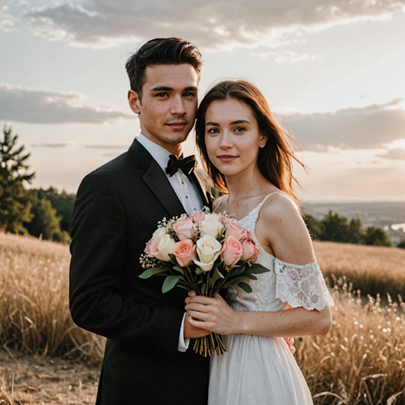
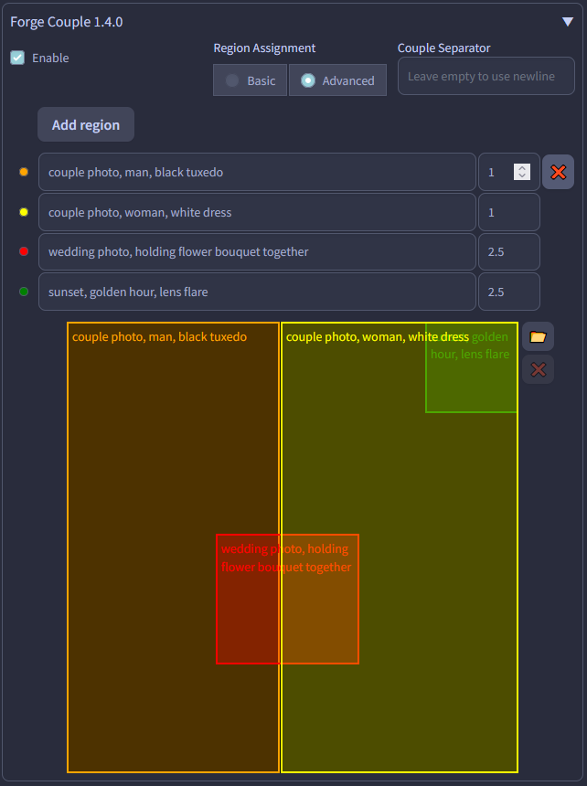

# SD Forge Attention Couple
This is an Extension for the [Forge Webui](https://github.com/lllyasviel/stable-diffusion-webui-forge), which allows you to ~~generate couples~~ target conditioning at different regions. No more color bleeds or mixed features!

> This does **not** work with [Automatic1111 Webui](https://github.com/AUTOMATIC1111/stable-diffusion-webui)

> As shown in the examples below, even if a region only contains 1 subject, it's usually still better to prompt for the total amount of subjects first.

## How to Use

### Lines Parsing

This Extension works by dividing the image into multiple tiles, each corresponding to one line in the prompt. So if you want more characters, just prompt more lines! Empty lines are skipped.

<p align="center">

</p>

```
[high quality, best quality], 2girls, blonde twintails, cyan eyes, white dress, looking at viewer, smile, blush
2girls, white long hair, red eyes, black dress, looking at viewer, frown
```

<p align="center">

</p>

```
[high quality, best quality], 3girls, blonde twintails, cyan eyes, white dress, looking at viewer, smile, blush
3girls, white long hair, red eyes, black dress, looking at viewer, frown
3girls, black ponytail, closed eyes, t-shirt, jeans, looking at viewer, sleepy
```

### Tile Direction

Choose between dividing the image into columns or rows
- **Horizontal:** Tiles from left to right
- **Vertical:** Tiles from top to bottom

<p align="center">
<br>
<b>Direction:</b><code>Vertical</code>
</p>

```
[high quality, best quality], galaxy, stars, milky way
blue sky, clouds
sunrise, lens flare
ocean, waves
beach, sand
pavement, road
```

### Global Effect

Set either the **first line** or the **last line** of the **Positive** prompts to affect the entire image instead of also being divided. Useful for specifying style, quality, or background, etc. (**Negative** prompt is always global regardless of settings.)

<p align="center">

</p>

```
[high quality, best quality], (cinematic), 2girls, beach, summer, day, sky, (bloom, hdr)
2girls, white dress, standing, wind, floating hair, looking at viewer, smile, blush
2girls, frills swimsuit, sitting, chair, knees up, smile, blush
```

<p align="center">

</p>

```
a cinematic photo of 2 men arguing, indoors, court room
2 men, jesus christ, white robe, looking at each other, shouting
2 men, santa claus, looking at each other, shouting
```

<p align="center">

</p>

```
a pencil drawing of scenery
mountains
river
tree
forest
```

### Couple Separator

By default, this Extension uses newline (`\n`) as the separator between tiles. You can also specify any keyword as the separator instead.

<p align="center">
<br>
<b>Separator:</b><code>~BA DUM TSS~</code>
</p>

```
masterpiece, white themed
heaven, clouds, bright, glowing
~BA DUM TSS~
illustration, red themed
hell, volcano, dark, dim
```

### LoRA Support

Using multiple LoRAs also works to a degree, depending on how well each LoRA works together...

LoRA with multiple subjects works better in my experience.

<p align="center">

</p>

```
2girls, nagase kotono, serafuku, looking at viewer, shy, blush, <lora:ktn:0.64>
2girls, kawasaki sakura, casual, looking at viewer, smile, blush, <lora:skr:0.64>
[high quality, best quality], 2girls, park, outdoors
```

<p align="center">

</p>

```
[high quality, best quality], 2girls, on stage, backlighting, [bloom, hdr], <lora:suzurena:0.72>
2girls, miyama suzune, pink idol costume, feather hair ornament, holding hands, looking at viewer, smile, blush
2girls, hanaoi rena, blue idol costume, feather hair ornament, holding hands, looking at viewer, shy, blush
```

## Advanced Mapping

If the above simple regions aren't enough, you can switch to the Advanced mode and define regions manually.
Simple click *Add region*, fill in the prompt, adjust the weight if required, and move/resize the box in
the canvas below.

If a box gets hidden behind another, you can click its prompt textbox to bring it to the front.

You can also type a background prompt in WebUI's main prompt textbox, but this is not required.
The example below uses the background prompt `a cinematic photo of a couple, from side, outdoors`.

<p align="center">


</p>

Other features:
- You can click the colored disc to the left of each prompt textbox to temporarily disable the region.
- You can load a background image into the canvas by clicking the 📂 button or drag&dropping a file onto it.
- On the img2img tab, you can load the current input image as a background by clicking the 🖼️ button.

<hr>

## Special Thanks
- Credits to the original author, **[laksjdjf](https://github.com/laksjdjf)**, whose original [ComfyUI Node](https://github.com/laksjdjf/cgem156-ComfyUI/tree/main/scripts/attention_couple) I used to port into Forge
- Example images were generated with [Animagine XL V3.1](https://civitai.com/models/260267) and [juggernautXL v7](https://civitai.com/models/133005)
